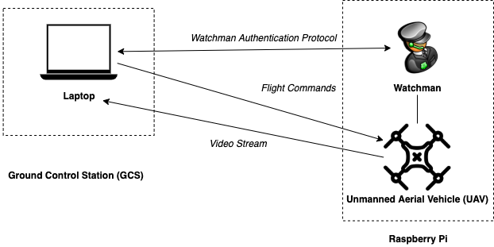

# Watchman

<pre align="center">
   
</pre>

Watchman secures communication between a drone (Unmanned Ariel Vehicle, UAV) and its controller (Ground Control Station, GCS).
It does this by creating a second, encrypted communication channel, which provides continuos authentication and network intrusion detection.
Watchman is based on the a research paper that outlines the [Encrypted Channel Architecture](https://ieeexplore.ieee.org/document/7926571/).

## Architecture

Watchman is a proof-of-concept tool.
As such, it has a very bare-bones architecture.

<pre align="center">
   
</pre>

## Setup

### Raspberry Pi

#### Setup

1. Download the Raspberry Pi OS onto the Pi using the [Raspberry Pi Imager](https://www.raspberrypi.org/downloads/).
2. Insert the `wpa_supplicant.conf` file into the boot folder to allow connection to the LAN.
   Template can be found [here](https://www.raspberrypi.org/documentation/configuration/wireless/headless.md).
   Also add a `ssh` file to the boot folder (file itself can be empty).
3. Power on the Pi and wait for ~1min for it to startup.
4. SSH in with `ssh pi@raspberrypi`.
   The default password is `raspberry`.
5. Change the root password of the Pi with `passwd`.
   Then, create a new user account using [these](https://www.raspberrypi.org/documentation/configuration/security.md) instructions.
   From now on, ensure everything is done through this new account.
6. Enable SSH'ing with only keys by running `ssh-copy-id -i ~/.ssh/<SSH-KEY> <USER>@raspberrypi` on the local machine.
7. Go to `/etc/ssh/sshd_config` on the Pi, disable these:
   ```
   ChallengeResponseAuthentication no
   PasswordAuthentication no
   UsePAM no
   ```
   And run `sudo service ssh reload`.

#### Installation

1. Create a new [SSH key](https://help.github.com/en/github/authenticating-to-github/generating-a-new-ssh-key-and-adding-it-to-the-ssh-agent#generating-a-new-ssh-key).
2. Copy it to the Pi: `scp <LOCATION>/id_rsa* <USER>@raspberrypi:~/.ssh`
3. Copy the installation script: `scp config/installation.sh <USER>@raspberrypi:~/`
4. Run the script: `ssh -t <USER>@raspberrypi 'sh installation.sh'`

## Testing

For running some basic unit tests, run:

```
python -m unittest -b
```

Append `-v` for a verbose output

<!-- TODO: License and Contribution -->
