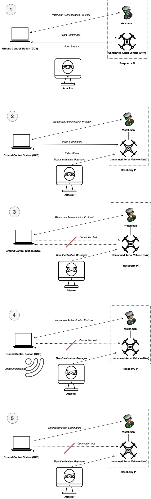
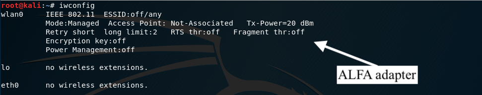
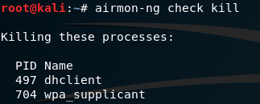
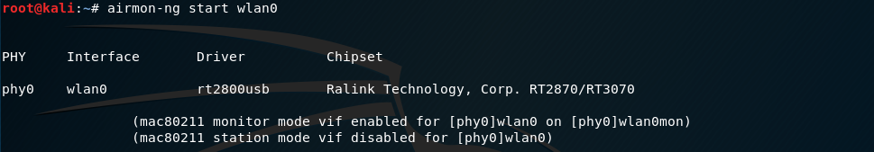
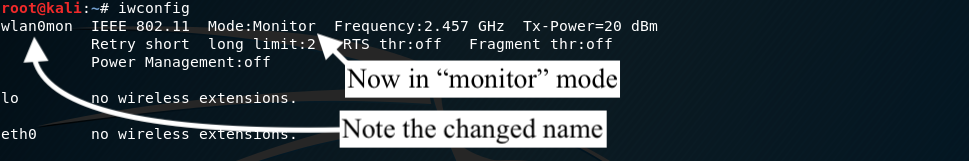
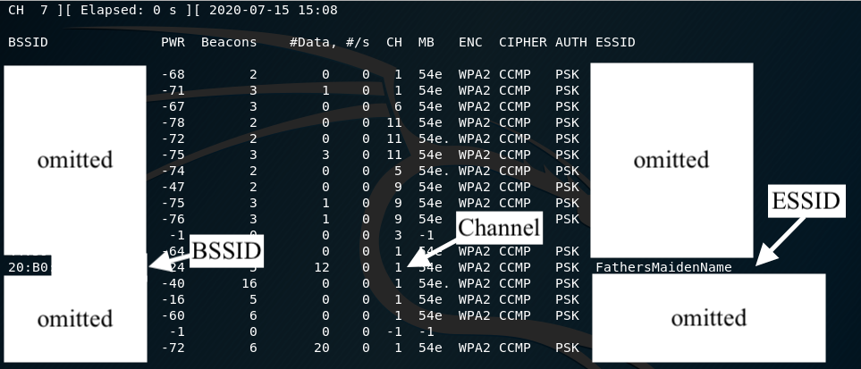
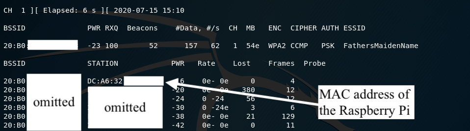
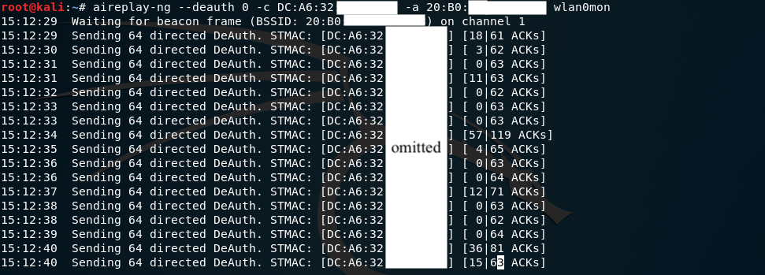

# Deauthentication Attack

Management frames, as outlined in 802.11 standards, are special messages used for communication between access points (e.g. routers) and stations (e.g. laptops/phones).
One type of management frame is a **deauthentication** frame, which is sent from the router to a station.
When the station receives the deauthentication frame, it automatically disconnects from the router.
It is possible to create a fake deauthentication frame and send it to a station.
As management frames are usually unencrypted, the station will think it is a legitmate message and disconnect from the router.
A deauthentication attack involves flooding the network with lots of fake deauthentication messages, such that the target station is unable to connect back to the router.
This effectively causes a denial of service.

<pre align="center">
   
</pre>

## Procedure

### Setting Up the Attacker

1. Connect the ALFA network adapter to the Kali computer.
   Check that the network adapter is connected by running `iwconfig`.
   Note the name of the connection - in this case, it is `wlan0`
   <pre align="center">
      
   </pre>

2. Kill any process that may interfere with the attacks with `airmon-ng check kill`.
   This may include Wi-Fi processes running for the Linux OS.
   <pre align="center">
      
   </pre>
3. Put the network adapter into _monitor mode_ with `airmon-ng start <NETWORK INTERFACE>`, where network interface is the equivalent of `wlan0`.
   <pre align="center">
      
   </pre>
   This will allow the attacker to inject (i.e. send) network packets to other stations.
   Double check the adapter is in monitor mode by running `iwconfig` again.
   <pre align="center">
      
   </pre>
4. Find the the access point (AP) of interest with `airodump-ng <NETWORK INTERFACE>`.
   <pre align="center">
      
   </pre>
   Press `CTRL + C` once the AP has been found.
   The AP can be identified by the ESSID column, which represents the name of the AP.
   Note down the BSSID (unique identifier) and channel of the AP.
5. Now, find the MAC address of the target station (i.e. the Raspberry Pi).
   Do this by running `airodrump-ng <NETWORK INTERFACE> --bssid <NETWORK BSSID> -c <NETWORK CHANNEL>`.
   <pre align="center">
      
   </pre>
   Note down the MAC address of the station.
   For example, MAC addresses starting with _DC-A6-32_ are Raspberry Pis. [Source](https://cleancss.com/mac-lookup/DC-A6-32)

### Attack

1.  Run `time sh run-ca.sh` from the base folder.
    The GCS control interface should appear.
    <!-- TODO: insert picutre -->
2.  On the attacker, ensure `airodrump-ng <NETWORK INTERFACE> --bssid <NETWORK BSSID> -c <NETWORK CHANNEL>` is running on one terminal.
    Open a new terminal and run the deauthentication attack: `aireplay-ng --deauth 0 -c <STATION MAC ADDR> -a <NETWORK BSSID> <NETWORK INTERFACE>`.
    <pre align="center">
       
    </pre>
3.

# Fixing the issue

Move to the 802.11w protocol - one that uses authenticated management frames.
