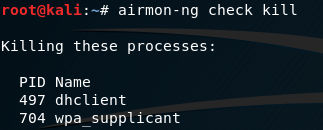
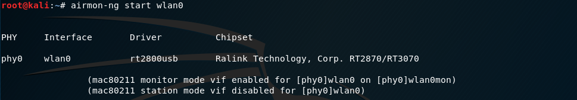
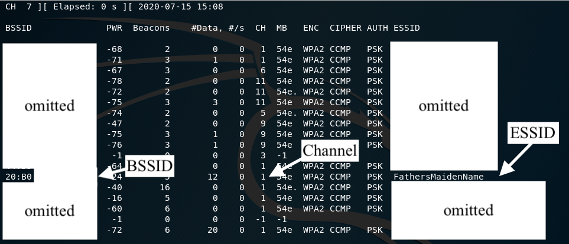

# Watchman Security Analysis - Overview

## Materials

- Attacker setup:
  - [Kali Linux](https://www.kali.org/downloads/)
  - ALFA network adapter
  - [aircrack-ng](https://www.aircrack-ng.org/doku.php?id=Main#download)
  - [hping3](https://tools.kali.org/information-gathering/hping3)
  - [tcpreplay](https://tcpreplay.appneta.com/)
  - Wireshark
- Current architecture (CA):
  - [Watchman](../README.md) (`gcs.py`)
- Watchman (ECA):
  - [Watchman](../README.md) (`gcs.py` and `receiver.py`)
  - [Snort](../README.md) (`snort/`)

## Methodology

1. Setup the current architecture and encrypted channel architecture according to the [README](../README.md).
2. Find the network channels and mac addresses ([instructions](#finding-network-channels-and-mac-addresses)).
3. Run either the `run-ca.sh` or `run-eca.sh` script for an automated flight path.
4. Run one of the [attacks](#attacks).
5. Copy the logfile from the UAV to the GCS for [post-experiment analysis](#metrics).
6. Repeat the experiment 5 times for validity.

### Attacks

1. [Deauthentication attack](./deauthentication.md)
2. [Network Flooding attack](./networkFlood.md)
3. [Brute Force attack](./bruteForce.md)
4. [Replay attack](./replay.md)
5. [Captured POI attack](./capturedPOI.md)

### Finding Network Channels and MAC Addresses

Some attacks require knowing the MAC address of the Raspberry Pi and the channel the UAV/GCS communication link is on.
To do this:

1. Connect the ALFA network adapter to the Kali computer.
   Check that the network adapter is connected by running `iwconfig`.
   Note the name of the connection - in this case, it is `wlan0`
   <pre align="center">
      
   </pre>

2. Kill any process that may interfere with the attacks with `airmon-ng check kill`.
   This may include Wi-Fi processes running for the Linux OS.
   <pre align="center">
      
   </pre>

3. Put the network adapter into _monitor mode_ with `airmon-ng start <NETWORK INTERFACE>`, where network interface is the equivalent of `wlan0`.
   <pre align="center">
      
   </pre>

   This will allow the attacker to inject (i.e. send) network packets to other stations.
   Double check the adapter is in monitor mode by running `iwconfig` again.
   <pre align="center">
      
   </pre>

4. Find the the access point (AP) of interest with `airodump-ng <NETWORK INTERFACE>`.
   <pre align="center">
      
   </pre>
   Press `CTRL + C` once the AP has been found.
   The AP can be identified by the ESSID column, which represents the name of the AP.
   Note down the BSSID (unique identifier) and channel of the AP.
5. Now, find the MAC address of the target station (i.e. the Raspberry Pi).
   Do this by running `airodrump-ng <NETWORK INTERFACE> --bssid <NETWORK BSSID> -c <NETWORK CHANNEL>`.
   <pre align="center">
      
   </pre>
   Note down the MAC address of the station.
   For example, MAC addresses starting with _DC:A6:32_ are Raspberry Pis. [Source](https://cleancss.com/mac-lookup/DC-A6-32)

### Metrics

For post-experiment analysis, the following metrics were measured.

1. Asset capacity: the remainder of the asset after being attacked/compromised
   - Here, we define the asset as the software or hardware that we are trying to protect from attack
   - In this case, our assets are the UAV and watchman
   - We consider an asset to be damaged if a part of it has been damaged
   - This can only occur if the attack was successful, and the UAV has dropped out of the sky
   - Therefore, we mark 1 for a successful attack, 0 otherwise
2. Exploit probability: how easy it is to exploit a vulnerability
   - Marking guide:
     - Automation (3): how much of the process can be automated?
     - Availability (3): how much of the attack could be downloaded/used from packages on the internet
     - Accessibility (3): is there special hardware or software required to buy before launching the attack?
     - Timing (3): does it take longer than 1min for the attack to work?
   - Scale the mark to being out of 1
3. Network resilience: the percentage of compromised services that can be replaced/recovered by backup services
   - The service being attacked is the `uav.py` script
   - The only service that could replace it is the `watchman.py` script
   - Therefore, if the `watchman.py` script is unaffected by the attack, then mark 1, 0 otherwise
4. Operational capacity: the remaining capacity of a service after being affected by a direct attack
   - Of the two threads in `uav.py`, how many are still functioning after the attack?
   - 1 if 2 threads, 0.5 if 1 thread, 0 if no threads
5. Service availability: the availability of a required service to support a particular task
   - Can the UAV still operate after a reboot?

After calculating the score for each experiment, the attacks were ranked:

1. Add the metrics (score/5) for each attempt of each attack
2. Take the average result of each attempt
3. Rank each of the attacks in terms of effectiveness

## Discussion

### Attack Discussion

- Validity/repeatability was good - averaged out the discrepancies between attacks by doing it multiple times
- Flight path was automated and ensured consistency
  - In order to ensure consistency between experiments, an automated flight path was established
  - The UAV would rise, then fly in a circle (more or less), then land
  - Flight path:
    - Up for 3 sec
    - Forward for 10 sec
    - Left for 10 sec
    - Forward for 10 sec
    - Down for 3 sec

### Metric Discussion

- Length of attack was not really considered between different cases
  - E.g. the brute force attack and captured POI attack didn't really have a time limit/measurable attack time
  - For the future, it should be reconsidered for a more general case
- Services could have been over-represented
  - Measured the availability, capacity and resilience of the `uav.py` script
  - Capacity was not super relevant to measuring the effectiveness of the attack
- Network resilience was unfairly weighted towards the watchman architecture
- To account for this, the battery life, weight and processing power were also considered as separate metrics
- If the watchman channel was attacked, the system would break

### Overall thoughts

- ECA architecture is good but it needs work
- It can be improved and tested more, but it might be worth looking into as a viable alternative architecture
